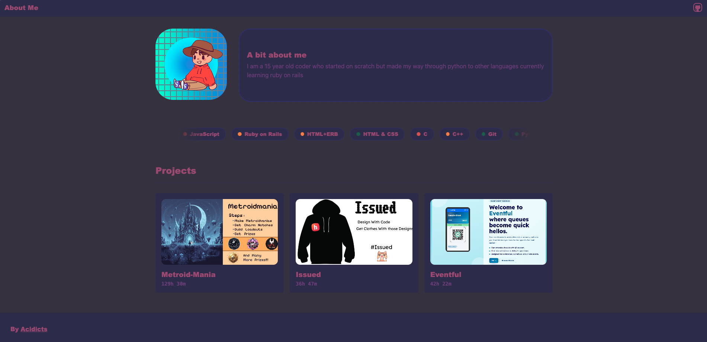

# My Personal Site - A static site
### With some javascript

# Nav Bar
A small title heading with a github icon to my repo on the right

# Sections:
## >>About Me 
A brief look about me
## >>Language Pills
A carosel of pills with the colours of red yellow or green depending on confidence with a hover title of level of skill
## >>Favourite Project
A display of my favourite projects made in ruby on rails made as hyperlinks connecting to their github repo

AI Usage:
- Used Claude for fixing styling bugs

Credits:
| What | Source | User / Org |
|------|--------|------------|
| Colour theme | [weulkin/firelight-23](https://lospec.com/palette-list/firelight-23) | [Valerie Lynn](https://lospec.com/weulkin) |
| Icons Sourced | icons.hackclub.com | @hackclub |